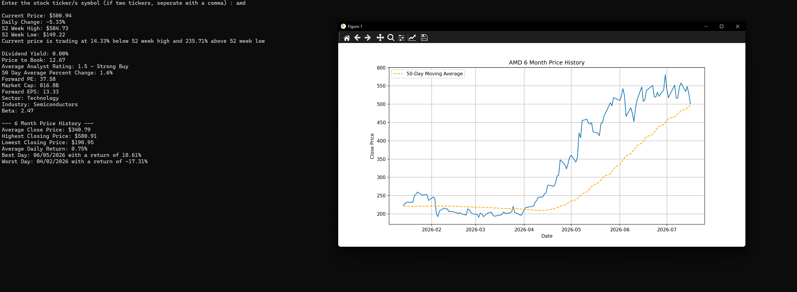
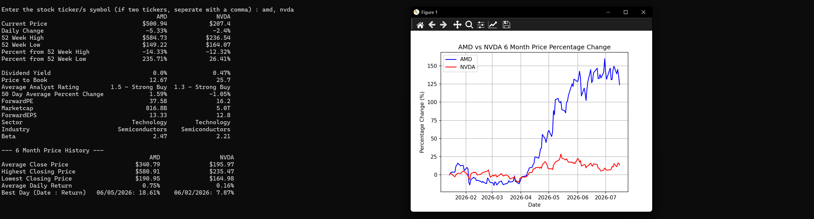

# Stock Ticker Tool

A Python-based stock comparison and screening tool that pulls live market data and presents key financial metrics, price history, and visual charts all from the command line.

Built as a personal project to combine my accounting and finance knowledge with Python, using real market data to practise the kind of analysis I'd do when screening investment opportunities.

## What it does

**Single ticker mode** — enter one ticker and get:
- 17 key metrics including current price, daily change, 52-week high/low (with distance from each), dividend yield, P/B, forward P/E, forward EPS, market cap, beta, sector, industry, and analyst rating
- 6-month price history summary (average close, highest/lowest close, average daily return, best and worst trading days)
- Price chart with 50-day moving average overlay

**Two ticker comparison mode** — enter two tickers (comma-separated) and get:
- Side-by-side comparison table across all 17 metrics
- 6-month price history summary for both
- Percentage change overlay chart comparing both tickers over 6 month period

The tool runs in a loop so you can screen multiple stocks in one session. Type `quit` to exit.

## Screenshots

### Single ticker output (AMD)

### Two ticker comparison (AMD vs NVDA)

## Built with

- **Python**
- **yfinance** — live market data
- **pandas** — data structuring and comparison tables
- **matplotlib** — price history and comparison charts

## What I learned

- Working with a live API and handling inconsistent data (missing keys, varying capitalisation in yfinance's response dictionaries)
- Defensive coding with `.get()` and try/except blocks to keep the tool running when data is unavailable
- Formatting financial data for readability (market cap scaling to B/T, percentage formatting, date formatting)
